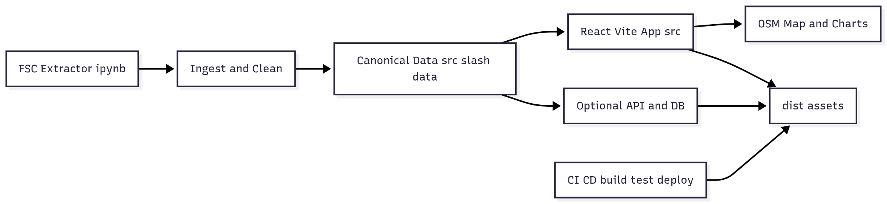

# BlackOut — Free Speech Tracker

**Project:** BlackOut (built during SFLC.in Hackathon)

**Focus:** Documenting free speech violations online content takedowns, website blocking, and film censorship in India.


## Overview

BlackOut (the Free Speech Tracker) is a data-first web application built to collect, analyze, and visualize incidents of censorship across India. The project was started during the SFLC.in Hackathon to provide a transparent public record of removals, blocking orders, and censorship decisions.

Why this project exists
- There are very few public, consolidated sources tracking how online speech is restricted in India.
- Manual entry and inconsistent formats make historical analysis difficult.
- Visualizations often lack geographic context and interactivity, limiting policy and research insights.

What BlackOut tries to achieve
- A searchable archive of incidents (takedowns, website blocks, film censorship cases).
- Rich dashboards with geographic and temporal views to explore trends.
- A platform for journalists, researchers, and citizens to investigate who orders takedowns, which platforms comply, and what kinds of content are targeted.


## Features

- Incidents archive with filters and a submission form (local persistence).
- Film censorship dataset with deterministic cuts/reasons/appeals generation.
- Blocked websites dataset and runtime aggregates.
- Interactive India map (OpenStreetMap + markers) showing state-level incident intensity, tooltips, and fly-to behavior.
- Charts for time-series, category distribution, and authority breakdowns.


## Architecture

## Architecture




## Datasets

This project stores canonical data inside the repository under `src/data/` and compiles visualizations at runtime.

- FSC_extractor
	- The `FSC_extractor` is the data-ingestion component used to parse, clean, and transform scraped or provided inputs into the repository's canonical datasets.
	- Use it to automate extraction from court orders, platform transparency reports, or CSV/JSON input.
	- Notebook and extractor link: [FSC_Extractor ipynb](Data_Extractor/FSC_Extractor.ipynb)

- Film dataset
	- The repository contains a film censorship dataset (years 2019–2025) with deterministic cuts/reasons/appeals generation.
	- Link to Dataset: [https://dataful.in/datasets/21452/]

- Blocked websites dataset
	- The blocked websites dataset contains 1000+ entries covering 2019–2025 and is used to compute charts and aggregates at runtime.
	- Link to Dataset: [[https://dataful.in/datasets/21452/](https://github.com/thejeshgn/blocked)]


## Getting started

Prerequisites
- Node.js (recommended v18+)
- npm or Yarn

Install

```bash
npm install
```

Run dev server

```bash
npm run dev
# or
npm start
```

Build for production

```bash
npm run build
```

Serve the built app (optional)

```bash
npx serve dist
```


## Contributing

If you'd like to contribute:
- Improve dataset ingestion (FSC_extractor) — automate transforms and create tested parsers for common sources.
- Add more sources, normalize authority names, and enrich records (platform, jurisdiction, order reference).
- Improve map accuracy — use official state polygons and a proper choropleth layer (GeoJSON hosted in `public/`).
- Add persistent backend storage and an authenticated moderation flow for user-submitted incidents.


## Notes on design decisions

- Geo: To avoid bundling very large GeoJSON files, the project uses a lightweight point-marker map approach (OpenStreetMap tiles + circle markers). A full polygon-based choropleth can be added later as an optional enhancement.
- Deterministic metadata: Film cuts/reasons/appeals are generated deterministically from a hash seed so UI values are repeatable across builds without manual edits.
- Local submissions: User-submitted incidents are saved to `localStorage` by default. You can wire a backend endpoint to persist them centrally.


## License & Attribution

This project was developed during the SFLC.in Hackathon. Check `LICENSE` in the repository for the license (if provided). OpenStreetMap tiles are used under their attribution requirements.


## Contact

If you want help extending the project, integrating datasets, or adding backend storage, open an issue or contact the maintainers listed in the repository.


---

